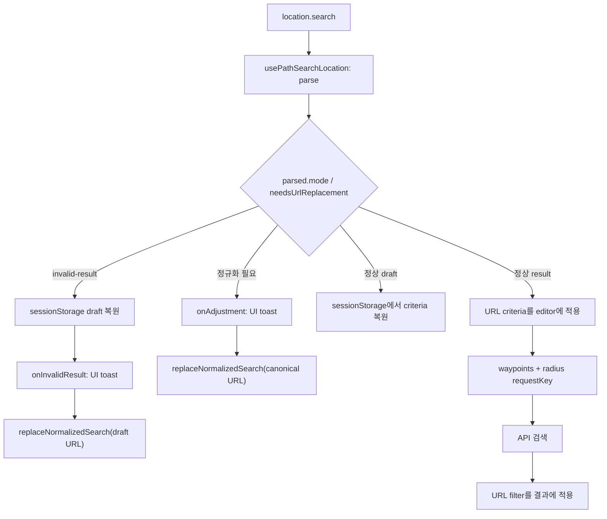

# 경로 검색 URL과 draft 상태 영속화

- 상태: 채택
- 작성일: 2026-09-04

## 배경

경로 기반 주유소 검색 화면은 웨이포인트와 반경을 편집하는 상태와, 확정된 조건으로 주유소를 조회하고 필터링하는 상태를 함께 제공한다.
기존 구현은 이 상태를 컴포넌트의 React state에만 보관했기 때문에 새로고침하면 편집 내용이 사라지고, 검색 결과 URL을 공유하거나 직접 다시 열 수 없었다.

다음 요구사항을 만족하는 상태 계약이 필요했다.

- 편집 중인 웨이포인트와 반경은 같은 탭에서 새로고침해도 복원한다.
- 검색 결과 URL은 API 요청에 사용한 조건을 완전히 표현하고 공유할 수 있어야 한다.
- result URL로 진입했을 때 기존 편집 상태가 검색 결과에 섞이거나 덮어써지면 안 된다.
- URL과 저장 데이터는 API 호출 전에 검증하고 정규화한다.
- 필터 변경은 이미 받은 결과에만 적용하며 API를 다시 호출하지 않는다.
- 검색 중에는 검색 조건 편집을 막되 지도 탐색은 허용한다.

## 결정 1. URL의 `mode`를 화면 상태의 기준으로 사용한다

경로 검색 페이지 경로는 `/search-station-by-path`를 유지한다.
화면 상태는 URL의 `mode`로 구분한다.

- `mode=draft`: 웨이포인트와 반경을 편집하는 화면
- `mode=result`: URL에 확정된 검색 조건으로 API를 호출하고 결과를 보여주는 화면

`mode`가 없거나 첫 번째 `mode` 값이 `draft | result`가 아니면 `draft`로 정규화한다.
정규화와 상태 전환에는 모두 browser history를 추가하지 않는 `replace`를 사용한다.

draft URL에서는 result 전용 파라미터인 `wp`, `radius`, `brand`, `localCurrency`를 제거한다.
검색과 무관한 쿼리 파라미터는 유지한다.

```text
/search-station-by-path?mode=draft
```

## 결정 2. result URL은 API 조건과 결과 필터를 명시적으로 저장한다

result URL 계약은 다음과 같다.

```text
/search-station-by-path
  ?mode=result
  &wp=37.5665,126.978
  &wp=37.5001,127.0365
  &radius=1.5
  &brand=SKE
  &brand=GSC
  &localCurrency=1
```

- `wp`: `위도,경도` 형식의 반복 파라미터다. 파라미터 순서가 웨이포인트 순서다.
- `radius`: km 단위 반경이다.
- `brand`: 선택한 브랜드 코드의 반복 파라미터다. 선택한 브랜드가 없으면 생략한다.
- `localCurrency`: 필터 적용 여부를 항상 `0 | 1`로 기록한다.
- 웨이포인트 ID는 URL에 기록하지 않는다. URL 복원 시 새 런타임 ID를 만든다.

브랜드는 `SKE`, `GSC`, `HDO`, `SOL`, `RTE`, `RTX`, `NHO`, `ETC`, `E1G`, `SKG`만 허용한다.
알 수 없는 브랜드는 제거하고, 중복 브랜드는 첫 번째 값만 유지한다.
선택된 유효 브랜드가 API 응답에 없어도 사용자가 필터를 해제할 수 있도록 필터 목록에는 응답 브랜드와 선택 브랜드의 합집합을 표시한다.

단일 값인 `mode`, `radius`, `localCurrency`가 반복되면 첫 번째 값을 해석하고 canonical URL에서는 하나만 기록한다.
잘못된 `localCurrency` 값은 `0`으로 정규화한다.

## 결정 3. 검색 조건은 사용 전에 검증하고 canonical 형태로 정규화한다

URL과 sessionStorage에 같은 좌표·개수·반경 정책을 적용한다.

### 좌표

- 위도와 경도는 유한한 숫자여야 한다.
- 위도는 `-90 이상 90 이하`, 경도는 `-180 이상 180 이하`만 허용한다.
- 좌표는 소수점 6자리로 반올림한다.
- 웨이포인트 하나의 좌표라도 잘못되면 URL 또는 저장 데이터 전체를 무효로 처리한다.

### 웨이포인트 개수

- result 검색에는 최소 1개가 필요하다.
- 최대 20개까지 허용한다.
- 20개를 초과하면 순서를 유지한 채 앞의 20개만 사용한다.

### 반경

- 기본값은 `1km`다.
- 허용 범위는 `1km 이상 5km 이하`다.
- 범위를 벗어나면 clamp하고 가장 가까운 `0.1km` 단위로 반올림한다.
- 누락됐거나 유한한 숫자로 파싱할 수 없으면 유효하지 않은 값이다.

웨이포인트 절단 또는 반경 조정이 필요하면 정규화된 URL을 먼저 확정한다. sessionStorage를 읽을 때는 정규화된 값을 반환하되 읽기 과정에서 저장소를 변경하지 않는다.
두 조정이 동시에 발생하면 하나의 안내 toast에 두 내용을 함께 표시한다.
좌표 정밀도, 브랜드, 지역화폐 값만 정규화된 경우에는 toast를 표시하지 않는다.

result에서 웨이포인트 또는 반경이 누락되거나 좌표·숫자가 유효하지 않으면 API를 호출하지 않는다.
오류 toast를 표시하고 result 전용 파라미터를 제거한 draft URL로 replace한다.

## 결정 4. sessionStorage는 마지막 draft 편집 상태만 소유한다

저장 키와 JSON 형식은 현재 다음과 같다.

```text
key: gil-charge:search-station-by-path:draft
```

```json
{
  "waypoints": [
    { "lat": 37.5665, "lng": 126.978 }
  ],
  "radiusKm": 1.5
}
```

필터와 웨이포인트 ID는 저장하지 않는다.
빈 웨이포인트 배열은 유효한 draft다.

draft에서는 다음 확정 편집마다 웨이포인트 전체와 반경을 저장한다.

- 웨이포인트 추가·삭제·전체 삭제
- 웨이포인트 이동 commit
- undo와 redo
- 반경 변경

JSON 파싱 실패, 잘못된 형식·좌표는 저장 데이터 전체를 무효로 처리하고 기본 draft를 반환한다. `readPathSearchDraft`는 읽기 전용이므로 잘못된 저장값을 자동 삭제하지 않는다.
개수 또는 반경만 정규화가 필요해도 읽기 과정에서 저장값을 다시 쓰지 않는다. 사용자가 다음 편집을 확정할 때 `writePathSearchDraft`로 정규화된 값이 저장된다.
브라우저가 sessionStorage 읽기·쓰기·삭제를 거부하더라도 화면 동작은 계속한다.

저장값이 없거나 무효이면 빈 웨이포인트와 기본 반경 `1km`로 시작한다.
복원된 웨이포인트는 undo/redo의 기준점이며, 복원 직후에는 이전 편집으로 undo할 수 없다.

검색 실행이나 성공으로 저장값을 삭제하지 않는다.
result URL에 진입하거나 result 검색이 성공했다는 이유만으로 저장값을 쓰지 않는다.

## 결정 5. 모드별 데이터 우선순위와 전환 규칙을 분리한다

### draft 진입과 새로고침

1. URL을 draft canonical 형태로 정규화한다.
2. sessionStorage를 읽고 검증한다.
3. 유효한 마지막 웨이포인트와 반경을 복원한다.
4. 저장값이 없거나 무효이면 초기 draft를 사용한다.
5. API는 호출하지 않는다.

### 검색 실행

1. 현재 편집 상태의 좌표와 반경을 정규화한다.
2. 필터가 선택되지 않은 canonical result URL을 만든다.
3. 현재 URL을 result URL로 replace한다.
4. URL에 반영된 조건으로 API를 호출한다.

검색 버튼 handler가 API를 직접 호출하지 않고 URL 변경이 요청의 원인이 되도록 한다.

### result 직접 진입과 새로고침

1. URL을 검증한다.
2. 필요한 경우 canonical result URL로 먼저 replace한다.
3. URL의 웨이포인트와 반경을 화면에 복원한다.
4. URL 조건으로 API를 호출한다.
5. 응답에 URL 필터를 적용한다.

이 과정에서 기존 sessionStorage는 result 상태나 API 입력에 사용하지 않으며, 삭제하거나 덮어쓰지 않는다.

### result에서 검색 조건 편집

검색 요청이 끝난 뒤 웨이포인트 또는 반경을 편집하면 수정된 전체 웨이포인트와 반경을 sessionStorage에 저장한다. 웨이포인트는 `useWaypointEditor`가 사용자 편집 확정 시 `onWaypointsCommit` callback으로 알리고, 외부 복원인 `restoreWaypoints`에서는 callback을 호출하지 않는다.
그 다음 result 전용 파라미터를 제거하고 draft URL로 replace한다.
result에서 수행한 편집은 draft 전환 뒤 첫 undo 대상으로 유지한다.

### result 필터 변경

브랜드 또는 지역화폐 필터 변경은 결과 목록에 즉시 적용하고 canonical result URL만 replace한다.
sessionStorage를 변경하지 않고 API를 다시 호출하지 않는다.

## 결정 6. API 요청 입력과 필터 상태를 분리한다

API 요청을 발생시키는 key는 정규화된 `waypoints + radiusKm`만으로 만든다.
브랜드와 지역화폐는 API 요청 조건이 아니라 클라이언트 결과 필터이므로 request key에 포함하지 않는다.

URL 동기화 effect와 API 요청 effect를 분리한다.
따라서 필터 변경으로 URL 전체가 바뀌어도 request key는 바뀌지 않고 API effect는 다시 실행되지 않는다.

`useSearchStationByPath`는 latest request wins 정책을 유지한다.

- 새 요청은 이전 요청을 `AbortController`로 취소한다.
- 취소된 요청은 성공·실패·재시도 상태를 만들지 않는다.
- 컴포넌트 unmount 시 진행 중인 요청을 취소한다.
- 재시도는 가장 최근 실패 당시의 canonical 웨이포인트와 반경을 그대로 사용한다.
- draft로 전환하면 진행 중인 요청과 요청 상태를 초기화한다.

### React StrictMode

개발 환경의 StrictMode는 effect에 대해 `setup → cleanup → setup`을 실행할 수 있다.
첫 setup에서 시작한 요청은 cleanup에서 취소될 수 있지만, 두 번째 setup은 같은 request key로 새 요청을 시작해야 한다.

요청 여부를 영구적인 `lastRequestRef`로 차단하지 않는다.
그 방식은 첫 요청이 cleanup에서 취소된 뒤 두 번째 setup까지 막아 요청 상태를 `loading`에 고정시킨다.
API effect를 재실행 가능한 구조로 두어 첫 요청이 취소되더라도 후속 요청이 정상 완료되게 한다.

따라서 개발자 도구에는 StrictMode가 취소한 최초 요청과 정상 완료된 후속 요청이 함께 보일 수 있다.
이는 오류가 아니며 최종 요청만 화면 상태를 갱신한다.

## 결정 7. 로딩과 실패 상태의 사용자 상호작용을 제한한다

검색 요청 중에는 다음 검색 조건 편집을 막는다.

- 웨이포인트 추가·삭제·전체 삭제
- 단일·다중 웨이포인트 이동
- undo와 redo
- 반경 변경
- 라쏘 선택 모드

지도 이동, 줌, 현재 위치 이동처럼 검색 조건을 바꾸지 않는 지도 조작은 허용한다.

재시도 가능한 실패는 검색 영역에 오류 문구와 지속적으로 노출되는 `다시 시도` 버튼을 표시한다.
재시도할 수 없는 실패는 기존 오류 코드별 inline, toast, silent 및 로깅 정책을 유지한다.
실패 후에는 검색 조건 편집이 다시 가능하며, result 조건을 편집하면 draft로 전환한다.

## 결정 8. URL, 동기화, UI 표현의 책임을 분리한다

URL 상태와 React 편집 상태를 한 훅에서 모두 소유하지 않는다.

- `usePathSearchLocation`: URL 파싱, canonical URL 생성, `replaceWithDraft`, `replaceWithResult`, `replaceNormalizedSearch`를 제공한다. sessionStorage와 waypoint editor를 알지 않는다.
- `usePathSearchSynchronization`: `parsed`를 기준으로 invalid-result 복구, 정규화 안내 이벤트, editor·radius·result filter 적용 순서를 결정한다. URL 문구나 toast 구현은 알지 않는다.
- `SearchStationByPathPage`: `parsed.mode`에서 화면 모드를 한 번 파생하고, semantic callback을 toast UI로 연결한다.
- `useWaypointEditor`: waypoint 편집과 undo/redo를 관리한다. 사용자 편집 확정은 `onWaypointsCommit`으로 알리고 외부 복원은 알리지 않는다.
- `pathSearchDraftStorage`: sessionStorage 입출력과 draft 검증·정규화를 담당한다.

정규화나 invalid-result 처리의 순서는 다음과 같다.



`usePathSearchLocation`은 navigation을 실행할 수 있는 함수를 제공하지만, 어떤 상황에서 호출할지는 `usePathSearchSynchronization`이 결정한다. 따라서 invalid-result에서는 draft 복원과 오류 toast 이후에 URL을 교체한다.

## 고려한 대안

### draft와 result를 React state로만 구분한다

- 장점: 구현이 단순하다.
- 단점: 새로고침과 URL 공유로 result를 복원할 수 없다.
- 판단: 공유 가능한 검색 결과와 명확한 데이터 소유권을 위해 URL을 기준으로 사용한다.

### result에서도 sessionStorage를 우선하거나 동기화한다

- 장점: 최근 편집 상태를 쉽게 재사용할 수 있다.
- 단점: 공유받은 URL의 검색 조건이 로컬 상태에 따라 달라지고, result 진입만으로 사용자의 마지막 draft를 잃을 수 있다.
- 판단: result에서는 URL만 사용하고 sessionStorage를 건드리지 않는다.

### 필터를 API request key에 포함한다

- 장점: URL 전체를 하나의 key로 다룰 수 있다.
- 단점: 클라이언트 필터 변경마다 동일한 경로 검색을 다시 요청한다.
- 판단: API 조건과 결과 필터를 분리한다.

### 동기화 훅에서 waypoint 상태를 감시해 사용자 편집을 추론한다

- 장점: editor hook의 변경 없이 저장을 연결할 수 있다.
- 단점: URL/storage 복원과 사용자 편집을 구분하기 위해 signature ref와 억제 플래그가 필요하고, 상태 변경의 출처를 추측하게 된다.
- 판단: `useWaypointEditor`가 사용자 commit을 명시적으로 알리는 `onWaypointsCommit` callback을 제공한다.

### 마지막 요청 key를 ref에 기록해 동일 요청을 차단한다

- 장점: 동일 effect의 중복 요청을 쉽게 막을 수 있다.
- 단점: StrictMode cleanup으로 실제 요청이 취소돼도 ref가 남아 후속 요청을 차단하고 loading 상태를 고정할 수 있다.
- 판단: effect를 재실행 가능하게 만들고 요청 훅의 취소 및 latest-wins 정책에 맡긴다.

## 결과

- draft는 같은 탭에서 마지막 편집 상태를 복원한다.
- result URL은 검색 조건과 필터를 공유·새로고침할 수 있는 형태로 완전히 표현한다.
- result는 로컬 저장 상태와 무관하게 동일한 API 요청과 필터 결과를 만든다.
- 정규화 전 값으로 API가 호출되지 않는다.
- 필터 변경은 URL과 화면에만 반영되고 네트워크 요청을 만들지 않는다.
- StrictMode 요청 취소 이후에도 후속 요청이 실행되어 loading 상태가 종료된다.

## 검증

- URL codec 단위 테스트에서 직렬화 왕복, 파라미터 순서, 좌표 반올림, 개수 제한, 반경 clamp, 필터 정규화, 무관한 쿼리 보존을 검증한다.
- sessionStorage 단위 테스트에서 복원, 정규화된 반환, 읽기 중 저장소 불변, 빈 draft를 검증한다.
- 웨이포인트 hook 테스트에서 복원 상태가 undo 기준점인지, 사용자 commit callback과 외부 복원이 구분되는지 검증한다.
- Playwright 테스트에서 result URL 직접 진입, StrictMode 취소 후 결과 표시, API 요청 body, 필터 변경 시 무재요청을 검증한다.
- 기존 웨이포인트 편집, 요청 취소와 race condition, 결과 필터 테스트를 함께 유지한다.

## 감수할 점

- URL이 여러 웨이포인트를 반복해서 포함하므로 검색 경로가 길어질 수 있다.
- sessionStorage는 탭 단위 저장소이므로 다른 탭이나 브라우저 세션과 draft를 공유하지 않는다.
- 허용 브랜드 코드를 추가하거나 변경할 때 URL 검증 상수도 함께 갱신해야 한다.
- URL 동기화, 편집 이력, 요청 상태가 서로 다른 책임을 가지므로 페이지 조정 계층에서 전환 순서를 명시적으로 관리해야 한다.
